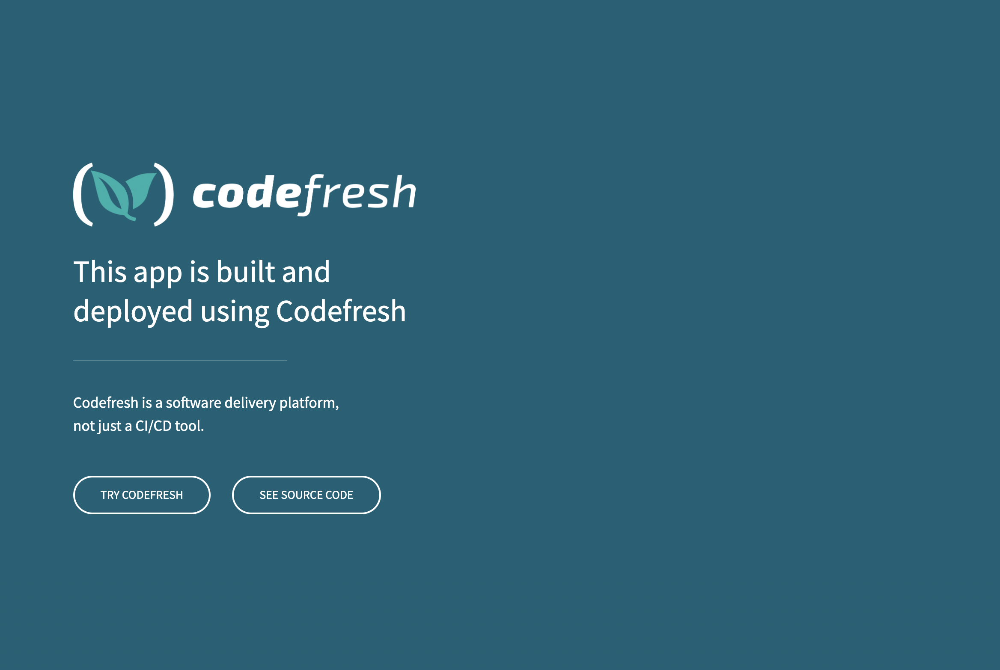

# Codefresh Web App


A simple web application built and deployed on [Codefresh.io](https://codefresh.io/).



## Usage

### Running as a Go Binary

```bash
$ VERSION=[release version] curl -Lo codefresh-web-app.tar.gz https://github.com/korenyoni/codefresh-web-app/releases/download/v${VERSION}/codefresh-web-app_${VERSION}_darwin_arm64.tar.gz
$ tar -xvzf codefresh-web-app.tar.gz
$ PORT=8080 ./codefresh-web-app
```

### Building and Running as a Container

```bash
$ make docker-build
$ docker run -p 8080:8080 korenyoni/codefresh-web-app
```

## Developing Locally

### Install `pre-commit` Git Hook Scripts

```bash
$ pre-commit install
```

### Run App Locally

```bash
$ make run
```
